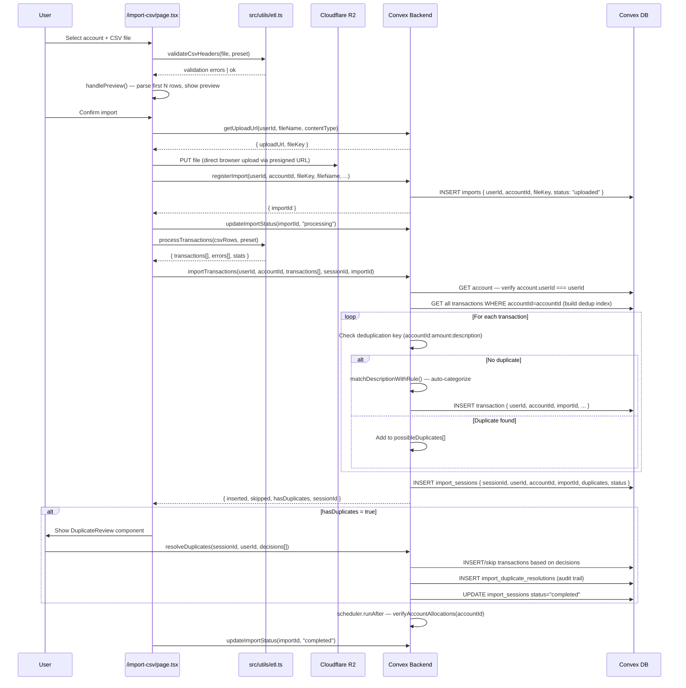

# Import Process & Presets — System Audit

**Purpose:** Pre-implementation audit to support the **Multi-Account Uploads** feature.  
**Date:** 2026-04-28  
**Scope:** CSV import pipeline, preset management, tenant isolation, and proposed integration points.

---

## Table of Contents

1. [Architecture Diagram](#1-architecture-diagram)
2. [Entry Points](#2-entry-points)
3. [Presets — Feature Breakdown](#3-presets--feature-breakdown)
4. [Validation Layer](#4-validation-layer)
5. [Transformation Logic](#5-transformation-logic)
6. [Tenant Isolation](#6-tenant-isolation)
7. [Duplicate Resolution Workflow](#7-duplicate-resolution-workflow)
8. [Database Schema & Relationships](#8-database-schema--relationships)
9. [File Reference Map](#9-file-reference-map)
10. [Blocking Points for Multi-Account Uploads](#10-blocking-points-for-multi-account-uploads)
11. [Proposed Integration Points](#11-proposed-integration-points)

---

## 1. Architecture Diagram



---

## 2. Entry Points

### 2.1 Upload & Registration

| File | Function | Purpose |
|------|----------|---------|
| `convex/importActions.ts` | `getUploadUrl` | Generates R2 presigned URL. Path: `imports/{userId}/{timestamp}-{fileName}` |
| `convex/imports.ts` | `registerImport` | Creates `imports` record with `status: "uploaded"`. Verifies `account.userId === userId`. |
| `convex/imports.ts` | `updateImportStatus` | Transitions status through `uploaded → processing → completed / failed`. |

### 2.2 Transaction Import

| File | Function | Purpose |
|------|----------|---------|
| `convex/transactions.ts` | `importTransactions` | Core mutation. Inserts transactions, builds dedup index, creates session. |
| `convex/transactions.ts` | `resolveDuplicates` | User decisions for flagged duplicates → insert or skip. |
| `convex/transactions.ts` | `mergeTransaction` | Updates existing transaction with new CSV data; preserves user edits. |
| `convex/transactions.ts` | `addAsNewTransaction` | Inserts duplicate as a completely new transaction; re-runs rules engine. |

### 2.3 Import History

| File | Function | Purpose |
|------|----------|---------|
| `convex/imports.ts` | `getImportHistory` | Lists all imports for a user, optionally filtered by `accountId`. |
| `convex/imports.ts` | `getImportDetails` | Full audit view: import + session + all transactions + duplicate resolutions. |
| `convex/imports.ts` | `getActiveImportSessions` | Sessions with `status = "awaiting_review"` — shown as resume-review cards on imports page. |

---

## 3. Presets — Feature Breakdown

Presets are reusable CSV parsing templates. There are no "global" presets — all presets are user-owned.

### Schema (`convex/schema.ts`)

```typescript
presets: defineTable({
    userId: v.id("users"),            // Owner — required, indexed
    name: v.string(),
    description: v.string(),
    delimiter: v.string(),
    hasHeader: v.boolean(),
    skipRows: v.number(),
    accountColumn: v.optional(v.string()), // Column that identifies the account in multi-account CSVs
    amountMultiplier: v.number(),
    categoryColumn: v.optional(v.string()),
    categoryGroupColumn: v.optional(v.string()),
    dateColumn: v.string(),           // Required
    dateFormat: v.string(),           // e.g. "%m/%d/%y"
    descriptionColumn: v.string(),    // Required
    amountColumns: v.array(v.string()),
    amountProcessing: v.any(),        // Complex debit/credit processing config
    transactionTypeColumn: v.optional(v.string()),
    createdAt: v.string(),
}).index("by_user", ["userId"])
```

### Preset–Account Link (`presetAccounts` table)

Many-to-many join. One preset can serve multiple accounts; one account has one active preset.

```typescript
presetAccounts: defineTable({
    presetId: v.id("presets"),
    accountId: v.id("accounts"),
}).index("by_preset", ["presetId"])
 .index("by_account", ["accountId"])
```

### `amountProcessing` Strategies

| Type | Config Shape | Use Case |
|------|-------------|----------|
| Debit/Credit columns | `{ debit_column, credit_column, debit_multiplier, credit_multiplier }` | Bank CSVs with separate debit/credit columns |
| Amount + type column | `{ amount_column, type_column, income_value, expense_value }` | CSVs with a single amount + transaction type indicator |
| Simple amount | `{ amount_column }` with global `amountMultiplier` | Single amount column; negative multiplier for expenses |

### CRUD Operations (`convex/presets.ts`)

| Function | Scoping | Notes |
|----------|---------|-------|
| `createPreset` | `userId` passed explicitly | No server-side auth enforcement |
| `listPresets` | `by_user` index | Returns all presets for user |
| `updatePreset` | None | ⚠️ No ownership check — relies on UI auth |
| `deletePreset` | None | ⚠️ No ownership check |
| `linkPresetToAccount` | None | ⚠️ No cross-ownership check |
| `unlinkPresetFromAccount` | None | ⚠️ No ownership check |
| `getAccountPreset` | None | Returns correct preset via join — no explicit auth |

---

## 4. Validation Layer

### CSV Header Validation (`src/utils/etl.ts` — `validateCsvHeaders`)

Collects all columns required by the preset and checks they exist in the CSV header row:

```typescript
requiredColumns = [
    preset.dateColumn,
    preset.descriptionColumn,
    ...preset.amountColumns,
    preset.transactionTypeColumn,      // if defined
    preset.categoryColumn,             // if defined
    preset.categoryGroupColumn,        // if defined
]
```

Returns an array of error strings for any missing columns. Client runs this in `handlePreview()` before ever calling Convex.

### Row-Level Validation (inside `importTransactions`)

For each transaction object arriving at the Convex mutation:

| Field | Check |
|-------|-------|
| `description` | Non-empty string |
| `amount` | Non-null, non-NaN number |
| `date` | Non-null, valid timestamp |

Failures are pushed to the `errors[]` array in the session — they do not abort the import.

### Account Ownership (in `importTransactions` and `registerImport`)

```typescript
const account = await ctx.db.get(accountId);
if (!account || account.userId !== userId) {
    throw new Error("Account not found or not owned by user");
}
```

This is the one hard authorization check that throws and aborts the entire mutation.

---

## 5. Transformation Logic

### Pipeline: Raw CSV Row → Database Transaction

**Input (sample CSV row):**
```json
{ "Transaction Date": "01/15/25", "Description": "STARBUCKS #1234", "Debit": "5.50", "Credit": "" }
```

**Step 1 — `parseDate()` (`src/utils/etl.ts`)**
- Converts `dateFormat` template (e.g. `%m/%d/%y`) to `date-fns` format
- Returns JS `Date` object; returns `null` on failure (triggers row-level error)

**Step 2 — `computeAmount()` (`src/utils/etl.ts`)**
- Strips `$`, commas, slashes
- Routes through the appropriate `amountProcessing` strategy
- Returns signed number (negative = expense)

**Step 3 — `normalizeTransaction()` (`src/utils/etl.ts`)**
- Assembles `NormalizedTransaction` with ISO date string, signed amount, raw description, and `rawData` (original row)

**Step 4 — Deduplication (inside `importTransactions`)**
- Key: `{accountId}:{amount}:{normalizeDescription(description)}`
- `normalizeDescription` = lowercase + trim + collapse whitespace
- Match → pushed to `possibleDuplicates`; no match → immediate insert

**Step 5 — Rules Engine (`matchDescriptionWithRule` in `convex/rulesEngine.ts`)**
- Tests description against user-configured keyword rules
- On match: sets `categoryId`, `transactionType`, `isAutoCategorized: true`, `appliedRuleId`

**Step 6 — DB Insert (`ctx.db.insert("transactions", ...)`)**
```typescript
{
    userId,
    accountId,
    date,           // Unix ms
    amount,
    description,
    importId,       // Foreign key to imports record
    transactionType,
    categoryId,
    isAutoCategorized,
    appliedRuleId,
    createdAt: Date.now(),
}
```

---

## 6. Tenant Isolation

### Summary Table

| Table | Scoping Field(s) | Hard Authorization Check | Index Used |
|-------|-----------------|--------------------------|-----------|
| `presets` | `userId` | ❌ (listPresets only) | `by_user` |
| `presetAccounts` | — (via preset/account FK) | ❌ | `by_preset`, `by_account` |
| `imports` | `userId`, `accountId` | ✅ `account.userId === userId` | `by_user`, `by_account` |
| `import_sessions` | `userId` | ✅ `session.userId === userId` | `by_user`, `by_session` |
| `import_duplicate_resolutions` | `userId` | ✅ via session check | `by_user`, `by_session` |
| `transactions` | `userId`, `accountId` | ✅ `account.userId === userId` | `by_user`, `by_account`, `by_import` |

### Where the Account Scope Lock Lives

The single most important scoping boundary for imports is in `convex/transactions.ts`:

```typescript
// importTransactions mutation — lines ~35-38
const account = await ctx.db.get(accountId);
if (!account || account.userId !== userId) {
    throw new Error("Account not found or not owned by user");
}
```

Every transaction inserted in this mutation inherits both `userId` and `accountId` from this verified pair. The `accountId` is a constant for the entire mutation call — meaning a single call to `importTransactions` can only insert into **one account**.

---

## 7. Duplicate Resolution Workflow

```
importTransactions
  └─► possibleDuplicates[] populated
        └─► import_sessions created with status = "awaiting_review"
              └─► UI: DuplicateReview component renders
                    └─► User decides per-duplicate:
                          ├─ "Merge" → mergeTransaction() (update existing, preserve category)
                          ├─ "Keep Both" → addAsNewTransaction() (insert new, re-run rules)
                          └─ "Skip" → resolveDuplicates(action: "skip") (no insert)
                    └─► import_duplicate_resolutions audit records created
                    └─► import_sessions status = "completed"
```

**Session persistence:** `sessionId` is stored in `localStorage` under `import_session_id`. On page reload, the imports page surfaces active sessions with a "Resume Review" button.

---

## 8. Database Schema & Relationships

```
users
 ├─── presets (by_user)
 │     └─── presetAccounts (by_preset) ──── accounts
 │
 ├─── accounts (by_user)
 │
 ├─── imports (by_user, by_account)
 │     └─── import_sessions (by_import)
 │           └─── import_duplicate_resolutions (by_session)
 │
 └─── transactions (by_user, by_account, by_import)
       └─── category_rules → categories (via appliedRuleId)
```

**Key foreign keys:**
- `imports.accountId` → `accounts._id`
- `imports.userId` → `users._id`
- `import_sessions.importId` → `imports._id`
- `transactions.importId` → `imports._id` (optional — set on imported transactions)
- `transactions.appliedRuleId` → `category_rules._id`
- `presetAccounts.presetId` → `presets._id`
- `presetAccounts.accountId` → `accounts._id`

---

## 9. File Reference Map

### Backend (Convex)

| File | Responsibility |
|------|----------------|
| `convex/schema.ts` | All table definitions and indexes |
| `convex/importActions.ts` | R2 presigned URL generation |
| `convex/imports.ts` | Import record CRUD, history, detail queries |
| `convex/transactions.ts` | importTransactions, resolveDuplicates, merge/addAsNew |
| `convex/presets.ts` | Preset CRUD and account linking |
| `convex/accounts.ts` | getAccountPreset (join via presetAccounts) |
| `convex/rulesEngine.ts` | Auto-categorization rule matching |
| `convex/allocations.ts` | Goal allocation verification (triggered post-import) |

### Frontend — Pages

| File | Purpose |
|------|---------|
| `src/app/import-csv/page.tsx` | Import wizard — 4 phases: upload, preview, reviewing, completed |
| `src/app/imports/page.tsx` | Import history list + active session cards |
| `src/app/imports/[id]/page.tsx` | Full import detail view with audit data |
| `src/app/presets/page.tsx` | Preset CRUD UI with linked accounts |

### Frontend — Components & Utilities

| File | Purpose |
|------|---------|
| `src/components/DuplicateReview.tsx` | Duplicate decision UI (merge / keep both / skip) |
| `src/utils/etl.ts` | CSV parsing, date/amount computation, header validation |

---

## 10. Blocking Points for Multi-Account Uploads

These are the exact constraints that prevent the system from importing transactions into multiple accounts in a single operation.

---

### BP-1: `importTransactions` accepts a single `accountId`

**File:** `convex/transactions.ts`  
**Signature:**
```typescript
importTransactions({
    userId: Id<"users">,
    accountId: Id<"accounts">,  // ← Single account only
    transactions: [...],
    sessionId: string,
    importId: Id<"imports">,
})
```
Every transaction inserted in this call is stamped with this one `accountId`. There is no mechanism to route individual rows to different accounts.

---

### BP-2: `registerImport` ties one import record to one account

**File:** `convex/imports.ts`  
```typescript
imports.insert({ userId, accountId, ... })
```
The `imports` table has a single `accountId` field with a `by_account` index. An import record represents one file imported into one account. Multi-account uploads would require either multiple import records or a schema change to remove the single-account constraint.

---

### BP-3: Client-side preset selection is per-account (single preset applied globally)

**File:** `src/app/import-csv/page.tsx`  
The import wizard resolves the preset once via `getAccountPreset(accountId)` before parsing. The same preset config — including column mappings — is applied to all rows. A multi-account CSV with per-account column structure would require either a global preset aware of the `accountColumn` field (which already exists in the schema but is not used) or per-row preset resolution.

---

### BP-4: Deduplication index is built per single account

**File:** `convex/transactions.ts`  
```typescript
const existingTransactions = await ctx.db
    .query("transactions")
    .withIndex("by_account", q => q.eq("accountId", accountId))
    .collect();
```
The dedup index covers one account. If rows in the same CSV belong to different accounts, each account's dedup set would need to be loaded separately.

---

### BP-5: `import_sessions` records a single `accountId`

**File:** `convex/schema.ts`  
```typescript
import_sessions: defineTable({
    accountId: v.id("accounts"),   // ← Single account
    ...
})
```
Session continuity for duplicate resolution is bound to one account. Multi-account imports would require sessions that carry per-account state or a collection of sub-sessions.

---

### BP-6: The `accountColumn` preset field exists but is not wired up

**File:** `convex/schema.ts` (presets table), `src/utils/etl.ts` (`PresetConfig` interface)  
The schema already has `accountColumn: v.optional(v.string())` and the ETL interface includes it in `PresetConfig`. However, no logic in `processTransactions()` or `importTransactions()` reads this field to route rows to different accounts. It is declared but dead.

---

## 11. Proposed Integration Points

The following changes would enable multi-account uploads with minimal risk to existing single-account behavior.

---

### INT-1: Activate `accountColumn` routing in the ETL pipeline

**File:** `src/utils/etl.ts` — `normalizeTransaction()`

Currently, `normalizeTransaction` does not return `account` in a usable form. Wire up the existing `accountColumn` logic so each normalized transaction includes `accountIdentifier: row[preset.accountColumn]` when the column is configured.

**Change:**  
`NormalizedTransaction` already has an `account` field. Populate it from `preset.accountColumn` when present. Leave single-account flow unchanged when `accountColumn` is `undefined`.

---

### INT-2: Add account resolution to the import page

**File:** `src/app/import-csv/page.tsx`

When the preset has `accountColumn` defined:
1. After preview, collect the unique account identifiers from the CSV.
2. Present a mapping UI: `"CSV value 'Checking' → [select account]"`.
3. Build a `Map<csvValue, accountId>` before starting the import.

When `accountColumn` is not defined, the existing single-account flow runs unchanged.

---

### INT-3: Accept a transaction router in `importTransactions`

**File:** `convex/transactions.ts`

Option A — Multiple calls (lowest risk):  
Client groups transactions by `accountId` after step INT-2 and calls `importTransactions` once per account, each with its own `importId`. Requires no server mutation changes. Multiple import records are created, one per account.

Option B — Server-side routing (more complex):  
Change the mutation signature to accept `transactions[]` where each row carries its own `accountId`. Load all accounts up front, verify ownership once, then route rows to per-account dedup indexes. Requires schema change to allow a single import record to reference multiple accounts or use a parent import record pattern.

**Recommendation:** Start with Option A. It reuses all existing code paths and the UX difference is minor.

---

### INT-4: Guard `linkPresetToAccount` with ownership validation

**File:** `convex/presets.ts` — `linkPresetToAccount`

As part of this feature, harden the API:

```typescript
// Before inserting presetAccounts record:
const preset = await ctx.db.get(presetId);
const account = await ctx.db.get(accountId);
if (preset.userId !== account.userId) {
    throw new Error("Preset and account must belong to the same user");
}
```

This closes BP-2 from the security notes above and prevents cross-user preset linking.

---

### INT-5: `updatePreset` / `deletePreset` ownership checks

**File:** `convex/presets.ts`

Add `userId` parameter to `updatePreset` and `deletePreset`, verify ownership before write:

```typescript
const preset = await ctx.db.get(presetId);
if (!preset || preset.userId !== userId) {
    throw new Error("Preset not found or not owned by user");
}
```

These are independent security improvements but are low-effort and reduce attack surface before rolling out multi-account upload UI.
